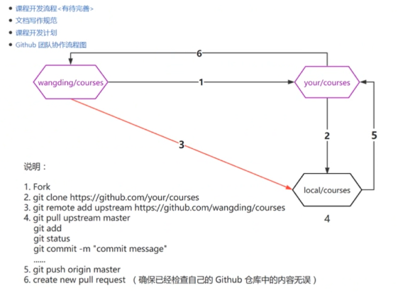

## git团队协作

----

### 邀请参加开源项目

##### 步骤

> 邀请人
>
> > 登录Github --> 进入仓库 --> Settings --> Manage access
>
> 被邀请人
>
> > 登录Github
> >
> > > 查看消息，接收邀请
> >
> > > 打开邀请网址，接收邀请

### 集中式工作流（最简单）

> 与`Subversion`的`trunk`相似
>
> `Git`叫做`master`，所有修改提交到`master`
>
> 该工作流只用到`master`这一个分支

##### 可能会出现的问题

###### 同一分支出现分叉

> 多人协作过程中，本地提交远程仓库（commit）之后，推到远程仓库（pull）之前，可能会出现分叉
>
> > 都有commit，出现不同的版本
>
> > 解决`git pull --rebase`
> >
> > > 使用rebase会将分叉合并为一条，这样就不会报错了

###### 多人修改同一文件

> 需要手动修改，确认版本

### 功能分支工作流

> 所有的功能开发应该在一个专门的分支，而不是在master分支上
>
> > 可以方便多个开发者在各自功能上开发而不会弄乱主干代码
> >
> > > 保证了master分支的代码一定不会是有问题的

##### pull request

> `pull request`
>
> > 能为每个分支发起一个讨论
> >
> > > 在功能分支并入主干之前，给其他开发者审核代码的机会
> >
> > > 如果你在功能开发中遇到问题卡住了，也可以开一个`pull request`来向其他小伙伴征求建议

##### 工作方式

> 功能分支工作流仍然用中央仓库，并且`master`分支还代表了正式项目的历史
>
> > 不直接提交本地变更到master分支
> >
> > > 开发者每次在开始新功能前线创建一个新分支
> > >
> > > > 功能分支应该有个描述性的名字
> > > >
> > > > > 如
> > > > >
> > > > > > `animated-menu-items`
> > > > > >
> > > > > > `issue-#1061`
>
> 分支内容可以push到中央仓库

##### 案例分析

> `minnersun`
>
> > `(master)git checkout -b feat-dialog`
> >
> > `touch c`
> >
> > > `echo 1111 >> c`
> > >
> > > `echo 2222 >> c`
> >
> > `git commit -am "edit c"`
> >
> > `git push origin feat-dialog`
> >
> > > `echo 3333 >> c`
> >
> > `git commit -am "finish the feature dialog"`
> >
> >  `git push -u origin feat-dialog`
>
> `mytest-2`
>
> > `minnersun`提交后，`mytest-2`登录系统
> >
> > > 打开到对应的仓库，可以看到`Comparable`和`Pull request`按钮
> >
> > 点击`Pull request`
> >
> > > 可以输入信息进行讨论
>
> `minnersun`
>
> > 登录仓库	-->  `Pull request` --> Files changed
> >
> > > 查看代码的变化，可以点击`+`，提bug
> >
> > 点击`Comversation`
> >
> > > 确认是否提交或者合并代码

### Gitflow工作流

> `Gitflow`工作流定义了一个围绕项目发布的严格分支模型
>
> 虽然比功能分支复杂，但提供了一个用于管理大型项目的健壮框架

> Gitflow为不同的分支分配一个很明显的角色
>
> 并定义分支之间如何和什么时候进行交互
>
> > 除了使用功能分支，在做准备、维护和记录发布也使用各自的分支

##### 历史分支

> 相对于仅用`master`分支，`Gitflow`工作流使用2个分支来记录项目的历史
>
> > `master`分支存储了正式发布的历史（每个版本会打一个tag）
> >
> > `develop`分支作为功能的集成分支

### Forking工作流(重点)

##### 流程

> 先fork别人的远程仓库到自己的远程仓库
>
> 
>
> 修改代码，提交到自己的远程仓库
>
> 最后由自己的仓库向官方仓库发起一个`pull request`
>
> > 如果官方仓库审核通过，即合并成功

> 1.fork远程仓库
>
> 2.从自己的远程仓库克隆（clone）到本地
>
> 3.增加与官方的远程连接
>
> 4.拖拽远程仓库边动代码
>
> > 为了与远程仓库代码同步
>
> 5.将边动提交到自己的远程仓库
>
> 6.申请将自己的代码合并到官方
>
> > 确保自己的代码无误

